# Lab 01: Building and Troubleshooting a Basic LAN

Ahmed, Umar, Haider, and Qasim need to communicate with each other over a small local network.

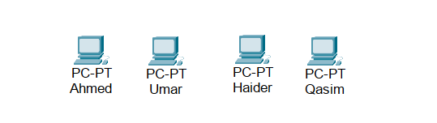

In this lab, we build a basic **Local Area Network (LAN)** using a Cisco 2960 switch.

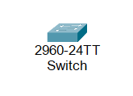


The intended IPv4 network for all four hosts is:

```text
192.168.1.0/24
```

The objective is not only to build the network, but also to **verify connectivity and troubleshoot a fault when communication does not work as expected**.

---

# 1. Lab Objectives

By completing this lab, I will practice:

* Building a basic LAN in Cisco Packet Tracer
* Connecting end devices to a Layer 2 switch
* Configuring IPv4 addresses and subnet masks
* Understanding `/24` subnetting
* Verifying connectivity with `ping`
* Identifying the difference between physical and logical connectivity
* Troubleshooting an IPv4 addressing problem
* Understanding how incorrect network addressing can prevent communication

---

# 2. Building the Network

We start with the simplest possible LAN.

A single **Cisco 2960 switch** acts as the central Layer 2 device, while four PCs connect to it.

### Topology

There is no router in this topology.

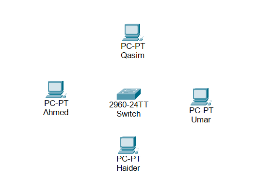

Therefore, this lab contains **one LAN and one IPv4 subnet** rather than multiple networks that need to be routed.

---

# 3. Choosing the IPv4 Network

Before configuring the hosts, we need an addressing plan.

The intended network is:

```text
192.168.1.0/24
```

| Parameter         | Value                         |
| ----------------- | ----------------------------- |
| Network           | `192.168.1.0/24`              |
| Subnet Mask       | `255.255.255.0`               |
| Network Address   | `192.168.1.0`                 |
| Usable Host Range | `192.168.1.1 – 192.168.1.254` |
| Broadcast Address | `192.168.1.255`               |
| Usable Hosts      | `254`                         |

With a `/24` subnet mask, the first three octets identify the network portion, while the final octet identifies individual hosts.

The four PCs will therefore be assigned addresses from the same subnet.

---

# 4. Intended Host Addressing Plan

The intended IPv4 configuration is:

| Device | Intended IP Address | Subnet Mask     |
| ------ | ------------------- | --------------- |
| Ahmed  | `192.168.1.1`       | `255.255.255.0` |
| Umar   | `192.168.1.2`       | `255.255.255.0` |
| Haider | `192.168.1.3`       | `255.255.255.0` |
| Qasim  | `192.168.1.4`       | `255.255.255.0` |

> **Important:** This table represents the intended addressing plan. The actual configuration of every host will be verified during the lab.

No default gateway is required for this lab because all four hosts are intended to communicate within the same local subnet and there is no router in the topology.

---

# 5. Configuring the Hosts

We configure the PCs through:

**PC → Desktop → IP Configuration**

### 5.1 Ahmed

Ahmed is configured with:

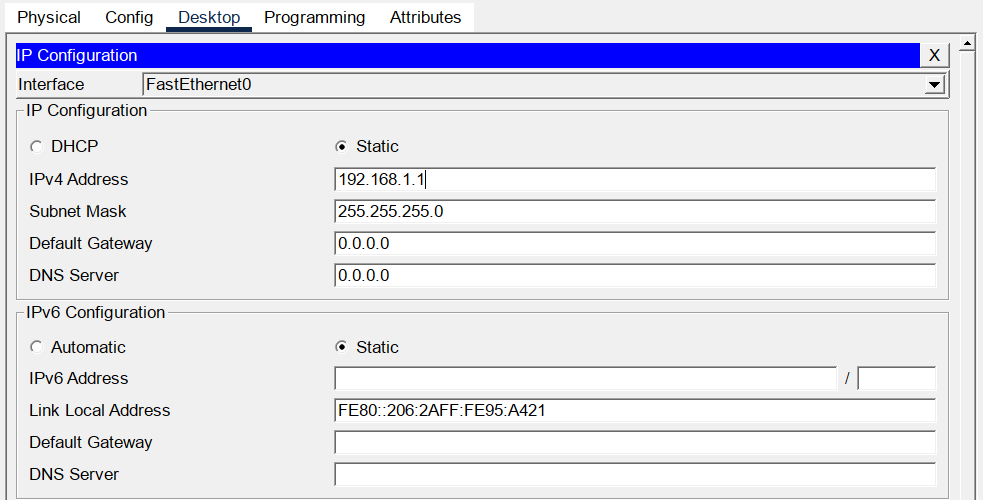

```text
IP Address:    192.168.1.1
Subnet Mask:   255.255.255.0
```

### 5.2 Umar

Umar is configured with:

```text
IP Address:    192.168.1.2
Subnet Mask:   255.255.255.0
```

### 5.3 Haider

Haider is configured with:

```text
IP Address:    192.168.1.3
Subnet Mask:   255.255.255.0
```

### 5.4 Qasim

Qasim is configured separately.


At this stage, we will not assume that every configuration is correct. The network will be tested after the physical connections are complete, and any unexpected behavior will need to be investigated.

---

# 6. Connecting the Hosts to the Switch

The four PCs are connected to the Cisco 2960 using **Copper Straight-Through** cables.

| Device | Switch Port | Cable                   |
| ------ | ----------- | ----------------------- |
| Ahmed  | `Fa0/1`     | Copper Straight-Through |
| Umar   | `Fa0/2`     | Copper Straight-Through |
| Haider | `Fa0/3`     | Copper Straight-Through |
| Qasim  | `Fa0/4`     | Copper Straight-Through |

### Physical Topology

At this point, the switch provides the **Layer 2 connectivity** between the four hosts.

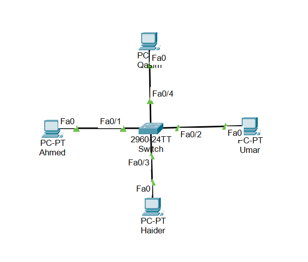

The next question is whether the hosts can actually communicate at the IP layer.

---

# 7. Devices Used

| Device  | Model      | Quantity | Role           |
| ------- | ---------- | -------: | -------------- |
| Switch0 | Cisco 2960 |        1 | Layer 2 switch |
| Ahmed   | PC         |        1 | End device     |
| Umar    | PC         |        1 | End device     |
| Haider  | PC         |        1 | End device     |
| Qasim   | PC         |        1 | End device     |

The Cisco 2960 forwards **Ethernet frames** between connected devices using information from its MAC address table.

However, successful IP communication also depends on the hosts having compatible IPv4 addressing.

---

# 8. Connectivity Test

The physical topology is complete and the hosts have been configured.

Now we test the network.

Rather than assuming that everything is working, we start with a simple connectivity test from Ahmed.

### Ahmed → Umar

```text
ping 192.168.1.2
```

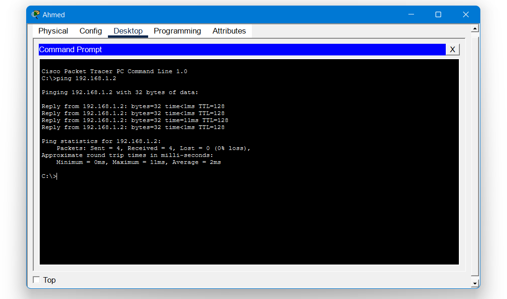

The ping succeeds.

Ahmed can communicate with Umar.

### Ahmed → Haider

```text
ping 192.168.1.3
```

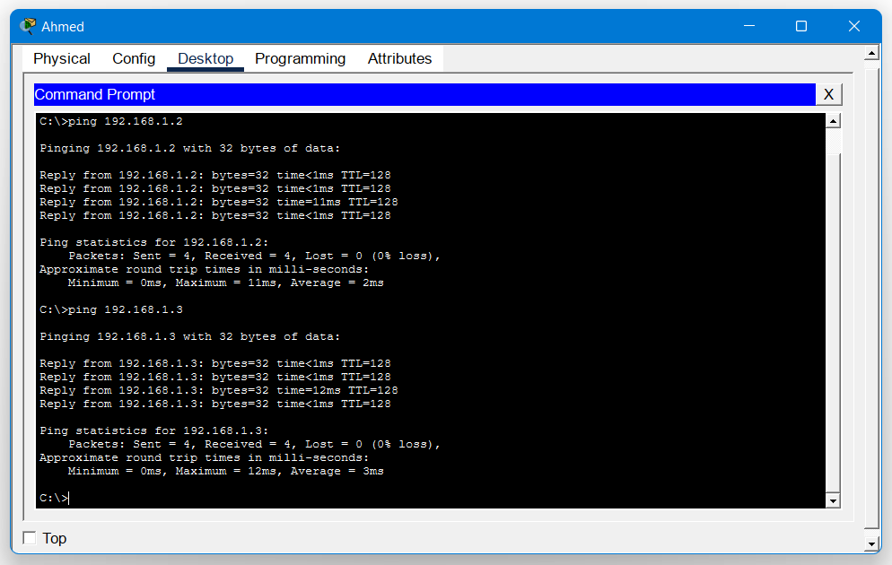

This test also succeeds.

So far, the network appears to be functioning correctly.

---

# 9. An Unexpected Failure

We now test communication with Qasim.

```text
ping 192.168.1.4
```

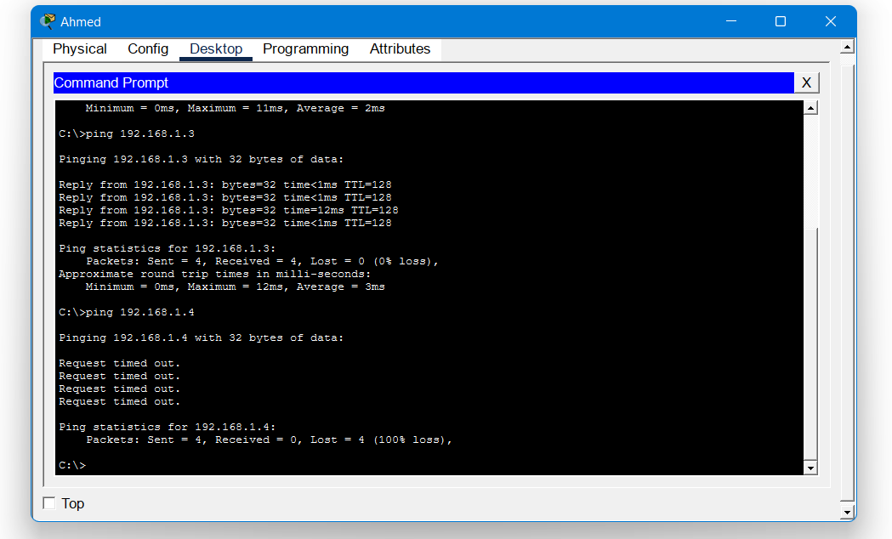

The ping fails.

This is unexpected.

Ahmed can communicate with Umar and Haider, but not Qasim.

At this point, we do **not** immediately assume that we know the cause.

Instead, we investigate systematically.

---

# 10. Troubleshooting Qasim

The first step is to determine whether the problem is physical or logical.

### Step 1 — Check the Physical Connection

Qasim is connected to:

```text
Switch0 Fa0/4
```

The link is active, so there is no immediate indication of a cable or physical-interface problem.

### Step 2 — Check the IP Configuration

We inspect Qasim's IPv4 configuration.

Qasim is configured with:

```text
IP Address:    192.168.2.4
Subnet Mask:   255.255.255.0
```

This is the first significant clue.

---

# 11. Identifying the Problem

Our intended network is:

```text
192.168.1.0/24
```

The other hosts are using addresses from:

```text
192.168.1.0/24
```

Qasim, however, is configured with:

```text
192.168.2.4/24
```

Using the subnet mask:

```text
255.255.255.0
```

Qasim belongs to:

```text
192.168.2.0/24
```

while Ahmed, Umar, and Haider belong to:

```text
192.168.1.0/24
```

Therefore, Qasim is **not in the same IPv4 subnet** as the other hosts.

### Why doesn't the switch solve this?

The Cisco 2960 is providing Layer 2 connectivity.

It can forward Ethernet frames within the LAN, but this topology contains no router or other Layer 3 device capable of routing traffic between:

```text
192.168.1.0/24
      ↕
192.168.2.0/24
```

So simply connecting Qasim to the same switch does not make the two IP networks communicate.

The problem is not the physical connection.

The problem is **incorrect Layer 3 addressing**.

---

# 12. Correcting Qasim's Configuration

We now correct Qasim's IPv4 configuration so that it matches the intended addressing plan.

Qasim is changed to:

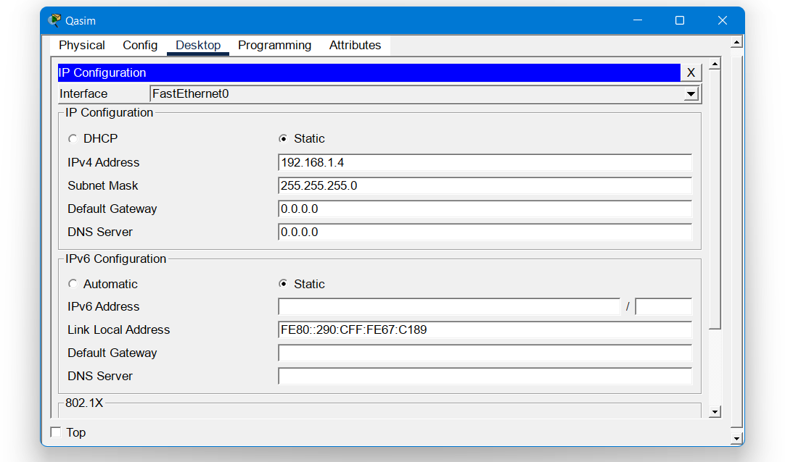

Qasim now belongs to the same IPv4 network as the other hosts.

---

# 13. Inspecting the Switch's MAC Address Table

After correcting Qasim's IP configuration, we know that the problem was at Layer 3.

However, we can also inspect the switch to understand what was happening at Layer 2.

The switch maintains a **MAC address table** that maps learned MAC addresses to the switch ports where those devices are connected.

From the Cisco 2960, we can view the table with:

```
Switch0# show mac address-table

```

The output should contain entries similar to:

```
Vlan    Mac Address       Type        Ports
----    -----------       --------    -----
  1     xxxx.xxxx.xxxx    DYNAMIC     Fa0/1
  1     xxxx.xxxx.xxxx    DYNAMIC     Fa0/2
  1     xxxx.xxxx.xxxx    DYNAMIC     Fa0/3
  1     xxxx.xxxx.xxxx    DYNAMIC     Fa0/4

```

The exact MAC addresses will depend on the Packet Tracer devices.

### What does this tell us?

The switch has learned which MAC address is reachable through each port:

```
Ahmed  → Fa0/1
Umar   → Fa0/2
Haider → Fa0/3
Qasim  → Fa0/4

```

This confirms that the switch has learned the connected hosts at **Layer 2**.

It is important to distinguish this from the earlier IP addressing problem.

The switch could learn Qasim's MAC address even while Qasim had the wrong IP address.

In other words:

```
Layer 2:
Qasim's MAC address → learned by the switch
                    ↓
                  Fa0/4

Layer 3:
Qasim's IP address → 192.168.2.4
                    ↓
              Wrong subnet

```

So the MAC address table helps demonstrate an important troubleshooting concept:

> **Layer 2 connectivity can be functioning correctly while Layer 3 communication is still failing.**

---

# 14. Verifying the MAC Address Table After Connectivity Testing

We can also generate traffic by pinging the hosts and then inspect the table again:

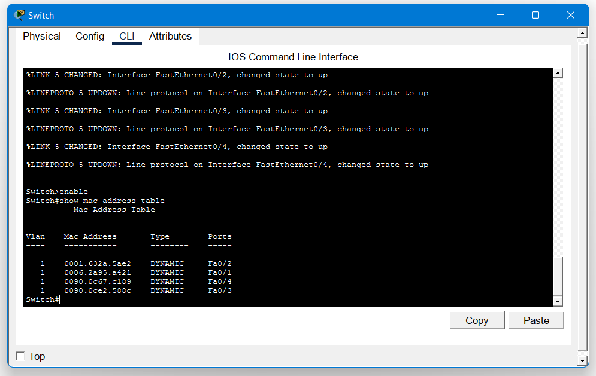

Because the switch learns source MAC addresses from Ethernet frames, traffic generated during our connectivity tests helps the switch build or refresh its MAC address table.

We can also inspect a specific interface:

```
Switch0# show mac address-table interface fa0/4

```

This allows us to check which MAC address the switch has learned on Qasim's port.

The MAC address table should continue to show Qasim's MAC address associated with `Fa0/4`, confirming that the switch has maintained the Layer 2 mapping for the host.

This reinforces an important troubleshooting principle:


**Layer 2 connectivity can be functioning correctly while Layer 3 communication is still failing.**


The switch can successfully learn and forward frames based on MAC addresses even when a host has an incorrect IPv4 configuration.

----

# 15. Verifying the Corrected Configuration

With Qasim's IP address corrected, we perform another connectivity test from Haider's PC to verify that Qasim is now reachable.

```text
ping 192.168.1.4
```

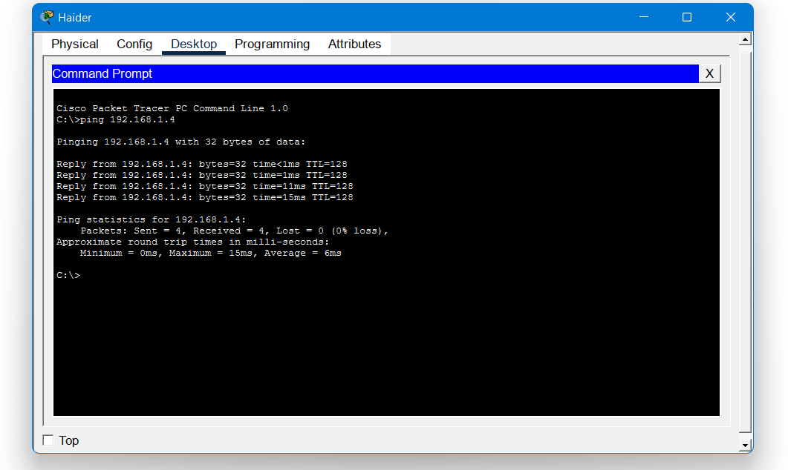

This time, the ping succeeds.

We can also verify communication from Qasim to the other hosts:

```text
Qasim → Ahmed
Qasim → Umar
Qasim → Haider
```

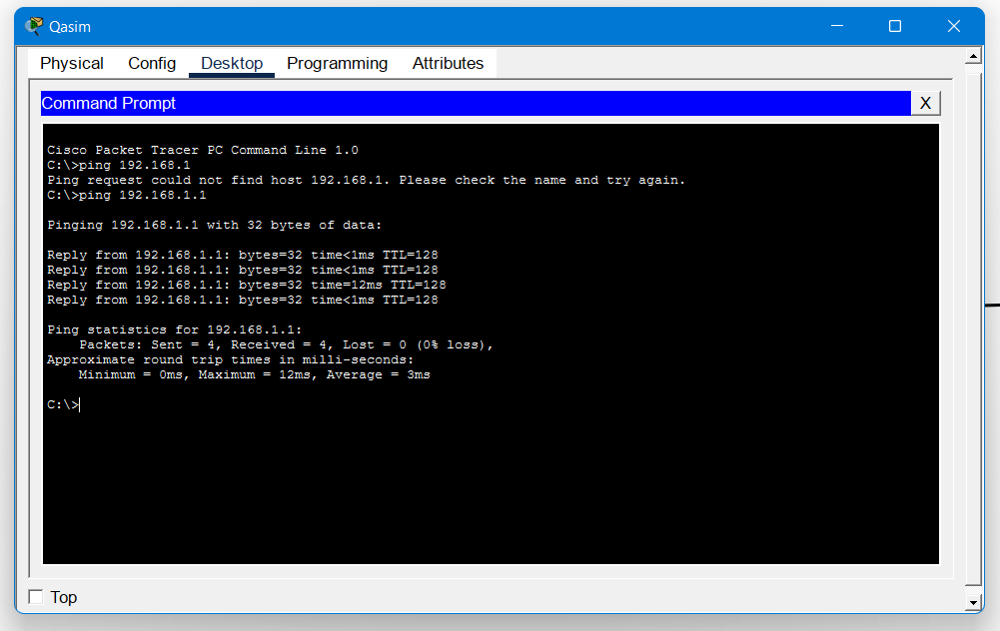

All four hosts can now communicate successfully within the LAN.

---

# 16. Final Addressing Table

| Device | IP Address    | Subnet Mask     | Network          |
| ------ | ------------- | --------------- | ---------------- |
| Ahmed  | `192.168.1.1` | `255.255.255.0` | `192.168.1.0/24` |
| Umar   | `192.168.1.2` | `255.255.255.0` | `192.168.1.0/24` |
| Haider | `192.168.1.3` | `255.255.255.0` | `192.168.1.0/24` |
| Qasim  | `192.168.1.4` | `255.255.255.0` | `192.168.1.0/24` |

---

# 17. Troubleshooting Process

The most important part of this lab was not simply correcting Qasim's IP address.

It was the process used to find the problem.

The investigation followed a basic troubleshooting sequence:

```text
Connectivity Failure
        ↓
Check Physical Connection
        ↓
Check Switch Port
        ↓ 
Check MAC Address Table
        ↓
Check Host Configuration
        ↓
Check IP Address
        ↓
Check Subnet Mask
        ↓
Determine Network Membership
        ↓
Identify Incorrect Configuration
        ↓
Correct Configuration
        ↓
Retest Connectivity
```

This approach is more reliable than immediately guessing what is wrong.

---

# 18. What I Learned

### A LAN connects devices within a local network

A LAN allows devices in a local environment to communicate with one another.

In this lab, all four PCs are connected to the same Cisco 2960 switch.

### A switch operates primarily at Layer 2

The switch forwards Ethernet frames using **MAC addresses**.

It does not need to know the IP address of a host to perform basic Layer 2 forwarding.

### Physical connectivity does not guarantee IP connectivity

Qasim was physically connected to the same switch as everyone else.

However, his IPv4 address placed him in a different subnet.

Therefore:

> **Being connected to the same switch does not automatically mean that devices can communicate at Layer 3.**

### The subnet mask determines network membership

With:

```text
255.255.255.0
```

the first three octets represent the network portion.

Therefore:

```text
192.168.1.4/24
```

belongs to:

```text
192.168.1.0/24
```

while:

```text
192.168.2.4/24
```

belongs to:

```text
192.168.2.0/24
```

### Routers are required to communicate between different IP networks

If Qasim had remained in:

```text
192.168.2.0/24
```

we would need a Layer 3 device, such as a router, to provide connectivity between the two networks.

---

# 19. Key Takeaways

* A **LAN** connects devices within a local network.
* A **switch** provides Layer 2 connectivity.
* Ethernet switches forward **frames** using MAC addresses.
* IPv4 communication depends on correct **IP addressing and subnetting**.
* A `/24` subnet provides **254 usable host addresses**.
* A **MAC address** is a Layer 2 hardware address used to identify a network interface on a Ethernet network. Switches uses MAC addresses to forward Ethernet frames between the ports.
* An **IP address** is a Layer 3 logical address used to identify a device and its network for IP communication. Routers use IP addresses to make forwarding decisions between different networks.
* Devices can be physically connected while still being unable to communicate at Layer 3.
* Devices in different IP networks require **Layer 3 routing** to communicate.
* Troubleshooting should begin with the basics and progressively narrow down the problem.
* MAC addresses identify interfaces at Layer 2, while IP addresses provide logical addressing at Layer 3.
* A successful ping is more than a connectivity test. It also provides evidence when troubleshooting network behavior.

---

# 20. Lab Files

### Packet Tracer Lab

| File            | Purpose                                                                                                         |
| --------------- | --------------------------------------------------------------------------------------------------------------- |
| `First-LAN.pkt` | Complete Cisco Packet Tracer lab file containing the topology, device configurations, and final working network |

### Topology & Configuration Images

| File                    | Purpose                                                        |
| ----------------------- | -------------------------------------------------------------- |
| `hosts.png`             | PCs used in the lab                                            |
| `switch-2960.png`       | Cisco 2960 switch                                              |
| `nocable-topology.png`  | Initial topology before cabling                                |
| `physical-topology.png` | Physical connection layout                                     |
| `config-ahmed.png`      | Ahmed's IPv4 configuration                                     |
| `config-qasim.png`      | Qasim's incorrect IPv4 configuration                           |
| `qasim-reconfig.png`    | Corrected Qasim configuration                                  |
| `mac-address-table.png` | Switch MAC address table after host MAC addresses were learned |

### Connectivity Test Evidence

| File                            | Purpose                                                                |
| ------------------------------- | ---------------------------------------------------------------------- |
| `ping-umar.png`                 | Successful Ahmed → Umar connectivity test                              |
| `ping-haider.png`               | Successful Ahmed → Haider connectivity test                            |
| `ping-qasim.png`                | Failed Ahmed → Qasim connectivity test                                 |
| `testing-qasim.png`             | Successful connectivity test after correcting Qasim's IP configuration |
| `qasim-pings.png`               | Final connectivity verification from Qasim to the other hosts          |

---

# 21. Lab Summary

The lab started with a simple objective:

> **Build a LAN where four hosts can communicate through a switch.**

The physical network was successfully built, but one host could not communicate with the others.

Instead of assuming the cause, the problem was investigated step by step.

The investigation revealed that Qasim had an IPv4 address belonging to a different subnet:

```text
Qasim:
192.168.2.4/24
```

while the intended LAN was:

```text
192.168.1.0/24
```

After correcting the address to:

```text
192.168.1.4/24
```

Connectivity was restored.

This lab demonstrated an important networking principle:

> **A functioning physical connection does not guarantee correct logical connectivity.**

---

# Next Step

The first LAN works.

But now there is a bigger question:

> **What happens when Ahmed's LAN needs to communicate with another LAN?**

That introduces the need for **Layer 3 routing**.

### [Lab 02: Connecting Two LANs Directly](Connecting-Two-LANs-Directly/)
